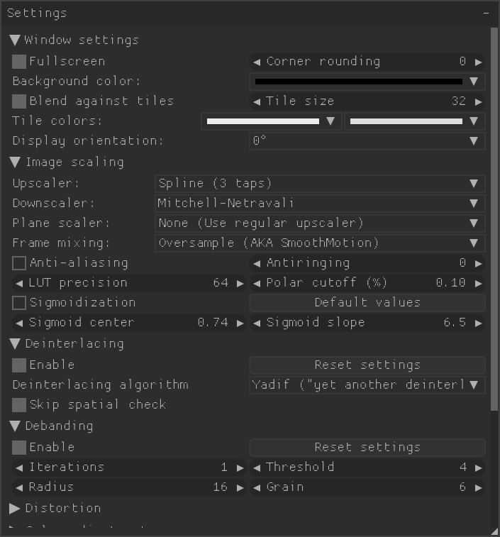
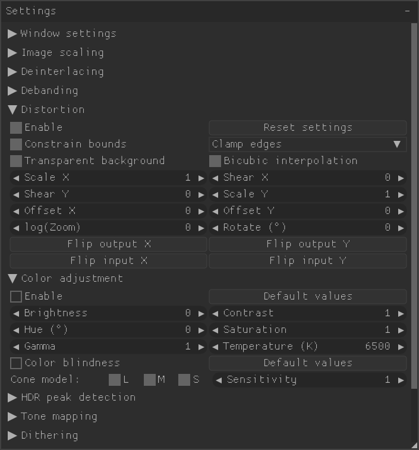
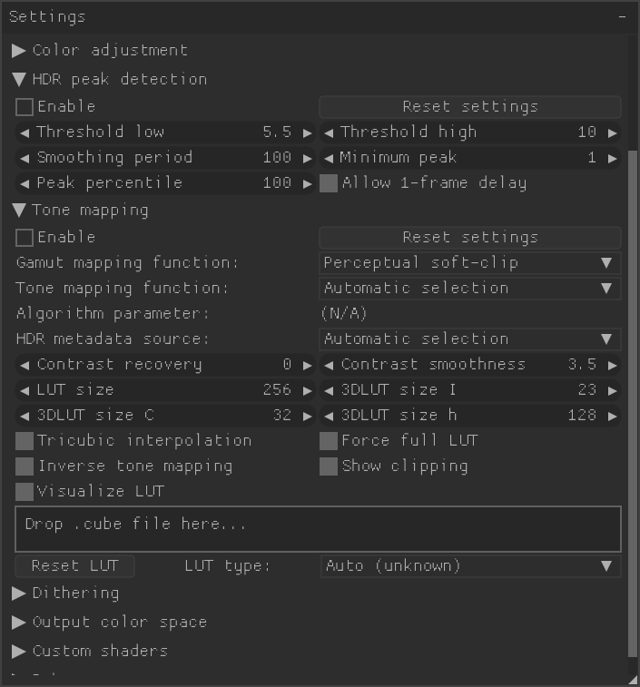
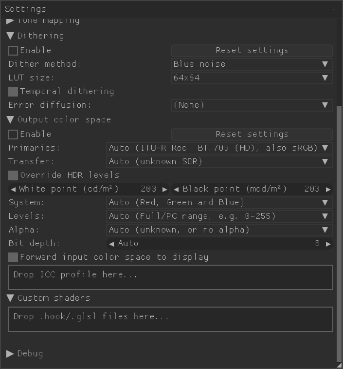
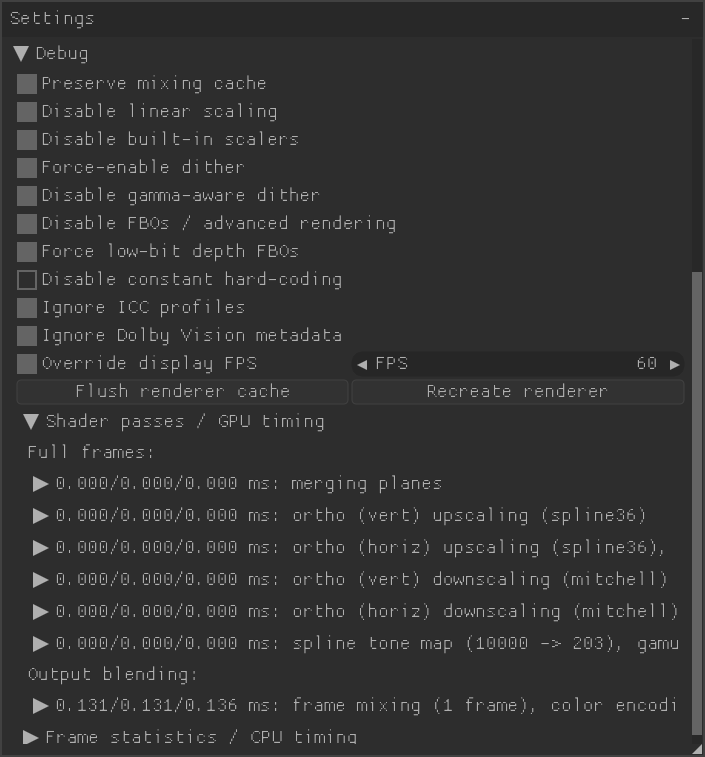
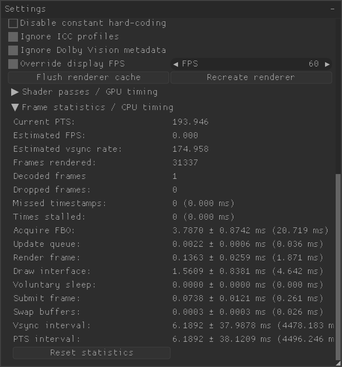

# libplacebo

[](https://code.videolan.org/videolan/libplacebo/pipelines)
[](https://code.videolan.org/videolan/libplacebo/-/jobs/artifacts/master/file/coverage/index.html?job=test-gpu)
[](https://github.com/sponsors/haasn)
[](https://www.paypal.com/cgi-bin/webscr?cmd=_s-xclick&hosted_button_id=SFJUTMPSZEAHC)
[](https://www.patreon.com/haasn)

**libplacebo** is, in a nutshell, the core rendering algorithms and ideas of
[mpv](https://mpv.io) rewritten as an independent library. As of today,
libplacebo contains a large assortment of video processing shaders, focusing
on both quality and performance. These include features such as the following:

- High-quality, optimized **upscaling and downscaling** including support for
  polar filters ("Jinc"), anti-aliasing, anti-ringing and gamma correct
  scaling.
- Dynamic **HDR tone mapping**, including real-time measurement of scene
  histogram, scene change detection, dynamic exposure control, perceptual gamut
  stretching, contrast recovery and more.
- Native support for **Dolby Vision HDR**, including conversion to HDR/PQ and,
  SDR, reading DV side data, and reshaping. (BL only, currently)
- A colorimetrically accurate **color management** engine with support for
  soft gamut mapping, ICC profiles, accurate ITU-R BT.1886 emulation, black
  point compensation, and custom 3DLUTs (.cube).
- A pluggable, extensible [**custom shader
  system**](http://libplacebo.org/custom-shaders/). This can be used to
  arbitrarily extend the range of custom shaders to include popular user
  shaders like RAVU, FSRCNNX, or Anime4K. See the [mpv wiki on user
  scripts](https://github.com/mpv-player/mpv/wiki/User-Scripts#user-shaders)
  for more information.
- High performance **film grain synthesis** for AV1 and H.274, allowing media
  players to offload this part of decoding from the CPU to the GPU.
- Tunable, fast **debanding** and **deinterlacing** shaders.
- High quality gamma-correct **dithering**, including error diffusion modes.

Every attempt was made to provide these features at a **high level of
abstraction**, taking away all the messy details of GPU programming, color
spaces, obscure subsampling modes, image metadata manipulation, and so on.
Expert-level functionality is packed into easy-to-use functions like
`pl_frame_from_avframe` and `pl_render_image`.

### Hardware requirements

libplacebo currently supports Vulkan (including MoltenVK), OpenGL, and
Direct3D 11. It currently has the following minimum hardware requirements:

- **Vulkan**: Core version 1.2
- **OpenGL**: GLSL version >= 130 (GL >= 3.0, GL ES >= 3.0)
- **Direct3D**: Feature level >= 9_1

For more documentation, including an introduction to the API, see [the project
website](https://libplacebo.org).

### Examples

This screenshot from the included [plplay demo program](./demos/plplay.c)
highlights just some of the features supported by the libplacebo rendering
code, all of which are adjustable dynamically during video playback.

[](./demos/screenshots/plplay1.png)
[](./demos/screenshots/plplay2.png)
[](./demos/screenshots/plplay3.png)

[](./demos/screenshots/plplay4.png)
[](./demos/screenshots/plplay5.png)
[](./demos/screenshots/plplay6.png)

### History

This project grew out of an interest to accomplish the following goals:

- Clean up mpv's internal [RA](#tier-1-rendering-abstraction) API and make it
  reusable for other projects, as a general high-level backend-agnostic
  graphics API wrapper.
- Provide a standard library of useful GPU-accelerated image processing
  primitives based on GLSL, so projects like media players or browsers can use
  them without incurring a heavy dependency on `libmpv`.
- Rewrite core parts of mpv's GPU-accelerated video renderer on top of
  redesigned abstractions, in order to modernize it and allow supporting more
  features.

It has since been adopted by [VLC](https://www.videolan.org/vlc/) as their
optional Vulkan-based video output path, and is provided as a Vulkan-based
video filter in the FFmpeg project.

## API Overview

The public API of libplacebo is currently split up into the following
components, the header files (and documentation) for which are available
inside the [`src/include/libplacebo`](src/include/libplacebo) directory. The
API is available in different "tiers", representing levels of abstraction
inside libplacebo. The APIs in higher tiers depend on those in lower tiers.
Which tier is used by a user depends on how much power/control they want over
the actual rendering. The low-level tiers are more suitable for big projects
that need strong control over the entire rendering pipeline; whereas the
high-level tiers are more suitable for smaller or simpler projects that want
libplacebo to take care of everything.

### Tier 0 (logging, raw math primitives)

- `colorspace.h`: A collection of enums and structs for describing color
  spaces, as well as a collection of helper functions for computing various
  color space transformation matrices.
- `common.h`: A collection of miscellaneous utility types and macros that are
  shared among multiple subsystems. Usually does not need to be included
  directly.
- `log.h`: Logging subsystem.
- `config.h`: Macros defining information about the way libplacebo was built,
  including the version strings and compiled-in features/dependencies. Usually
  does not need to be included directly. May be useful for feature tests.
- `dither.h`: Some helper functions for generating various noise and dithering
  matrices. Might be useful for somebody else.
- `filters.h`: A collection of reusable reconstruction filter kernels, which
  can be used for scaling. The generated weights arrays are semi-tailored to
  the needs of libplacebo, but may be useful to somebody else regardless. Also
  contains the structs needed to define a filter kernel for the purposes of
  libplacebo's upscaling routines.
- `tone_mapping.h`: A collection of tone mapping functions, used for
  conversions between HDR and SDR content.
- `gamut_mapping.h`: A collection of gamut mapping functions, used for
  conversions between wide gamut and standard gamut content, as well as
  for gamut recompression after tone-mapping.

The API functions in this tier are either used throughout the program
(context, common etc.) or are low-level implementations of filter kernels,
color space conversion logic etc.; which are entirely independent of GLSL
and even the GPU in general.

### Tier 1 (rendering abstraction)

- `gpu.h`: Exports the GPU abstraction API used by libplacebo internally.
- `swapchain.h`: Exports an API for wrapping platform-specific swapchains and
  other display APIs. This is the API used to actually queue up rendered
  frames for presentation (e.g. to a window or display device).
- `vulkan.h`: GPU API implementation based on Vulkan.
- `opengl.h`: GPU API implementation based on OpenGL.
- `d3d11.h`: GPU API implementation based on Direct3D 11.
- `dummy.h`: Dummy GPI API (interfaces with CPU only, no shader support)

As part of the public API, libplacebo exports a middle-level abstraction for
dealing with GPU objects and state. Basically, this is the API libplacebo uses
internally to wrap OpenGL, Vulkan, Direct3D etc. into a single unifying API
subset that abstracts away state, messy details, synchronization etc. into a
fairly high-level API suitable for libplacebo's image processing tasks.

It's made public both because it constitutes part of the public API of various
image processing functions, but also in the hopes that it will be useful for
other developers of GPU-accelerated image processing software.

### Tier 2 (GLSL generating primitives)

- `shaders.h`: The low-level interface to shader generation. This can be used
  to generate GLSL stubs suitable for inclusion in other programs, as part of
  larger shaders. For example, a program might use this interface to generate
  a specialized tone-mapping function for performing color space conversions,
  then call that from their own fragment shader code. This abstraction has an
  optional dependency on `gpu.h`, but can also be used independently from it.

In addition to this low-level interface, there are several available shader
routines which libplacebo exports:

- `shaders/colorspace.h`: Shader routines for decoding and transforming
  colors, tone mapping, and so forth.
- `shaders/custom.h`: Allows directly ingesting custom GLSL logic into the
  `pl_shader` abstraction, either as bare GLSL or in [mpv .hook
  format](https://mpv.io/manual/master/#options-glsl-shaders).
- `shaders/deinterlacing.h`: GPU deinterlacing shader based on yadif.
- `shaders/dithering.h`: Shader routine for various GPU dithering methods.
- `shaders/film_grain.h`: Film grain synthesis shaders for AV1 and H.274.
- `shaders/icc.h`: Shader for ICC profile based color management.
- `shaders/lut.h`: Code for applying arbitrary 1D/3D LUTs.
- `shaders/sampling.h`: Shader routines for various algorithms that sample
  from images, such as debanding and scaling.

### Tier 3 (shader dispatch)

- `dispatch.h`: A higher-level interface to the `pl_shader` system, based on
  `gpu.h`. This dispatch mechanism generates+executes complete GLSL shaders,
  subject to the constraints and limitations of the underlying GPU.

This shader dispatch mechanism is designed to be combined with the shader
processing routines exported by `shaders/*.h`, but takes care of the low-level
translation of the resulting `pl_shader_res` objects into legal GLSL. It also
takes care of resource binding, shader input placement, as well as shader
caching and resource pooling; and makes sure all generated shaders have unique
identifiers (so they can be freely merged together).

### Tier 4 (high level renderer)

- `options.h`: A high-level options framework which wraps all of the options
  comprising `pl_render_params` into a memory-managed, serializable struct that
  can also be treated as a key/value dictionary. Also includes an options
  parser to load options provided by the API user in string format.
- `renderer.h`: A high-level renderer which combines the shader primitives
  and dispatch mechanism into a fully-fledged rendering pipeline that takes
  raw texture data and transforms it into the desired output image.
- `utils/frame_queue.h`: A high-level frame queuing abstraction. This API
  can be used to interface with a decoder (or other source of frames), and
  takes care of translating timestamped frames into a virtual stream of
  presentation events suitable for use with `renderer.h`, including any extra
  context required for frame interpolation (`pl_frame_mix`).
- `utils/upload.h`: A high-level helper for uploading generic data in some
  user-described format to a plane texture suitable for use with `renderer.h`.
  These helpers essentially take care of picking/mapping a good image format
  supported by the GPU. (Note: Eventually, this function will also support
  on-CPU conversions to a different format where necessary, but for now, it
  will just fail)
- `utils/dav1d.h`: High level helper for translating between Dav1dPicture
  and libplacebo's `pl_frame`. (Single header library)
- `utils/libav.h`: High-level helpers for interoperation between
  libplacebo and FFmpeg's libav* abstractions. (Single header library)

This is the "primary" interface to libplacebo, and the one most users will be
interested in. It takes care of internal details such as degrading to simpler
algorithms depending on the hardware's capabilities, combining the correct
sequence of colorspace transformations and shader passes in order to get the
best overall image quality, and so forth.

## Authors

libplacebo was founded and primarily developed by Niklas Haas
([@haasn](https://github.com/haasn)), but it would not be possible without the
contributions of others, especially support for windows.

[](https://github.com/haasn/libplacebo/graphs/contributors)

### License

libplacebo is currently available under the terms of the LGPLv2.1 (or later)
license. However, it's possible to release it under a more permissive license
(e.g. BSD2) if a use case emerges.

Please open an issue if you have a use case for a BSD2-licensed libplacebo.

## Installing

### Obtaining

When cloning libplacebo, make sure to provide the `--recursive``` flag:

```bash
$ git clone --recursive https://code.videolan.org/videolan/libplacebo
```

Alternatively (on an existing clone):

```bash
$ git submodule update --init
```

Doing either of these pulls in a handful of bundled 3rdparty dependencies.
Alternatively, they can be provided via the system.

### Building from source

libplacebo is built using the [meson build system](http://mesonbuild.com/).
You can build the project using the following steps:

```bash
$ DIR=./build
$ meson $DIR
$ ninja -C$DIR
```

To rebuild the project on changes, re-run `ninja -Cbuild`. If you wish to
install the build products to the configured prefix (typically `/usr/local/`),
you can run `ninja -Cbuild install`. Note that this is normally ill-advised
except for developers who know what they're doing. Regular users should rely
on distro packages.

### Dependencies

In principle, libplacebo has no mandatory dependencies - only optional ones.
However, to get a useful version of libplacebo. you most likely want to build
with support for either `opengl`, `vulkan` or `d3d11`. libplacebo built without
these can still be used (e.g. to generate GLSL shaders such as the ones used in
VLC), but the usefulness is severely impacted since most components will be
missing, impaired or otherwise not functional.

A full list of optional dependencies each feature requires:

- **glslang**: `glslang` + its related libraries (e.g. `libSPIRV.so`)
- **lcms**: `liblcms2`
- **libdovi**: `libdovi`
- **opengl**: `glad2` (*)
- **shaderc**: `libshaderc`
- **vulkan**: `libvulkan`, `python3-jinja2` (*)

(*) This dependency is bundled automatically when doing a recursive clone.

#### Vulkan support

Because the vulkan backend requires on code generation at compile time,
`python3-mako` is a hard dependency of the build system. In addition to this,
the path to the Vulkan registry (`vk.xml`) must be locatable, ideally by
explicitly providing it via the `-Dvulkan-registry=/path/to/vk.xml` option,
unless it can be found in one of the built-in hard-coded locations.

### Configuring

To get a list of configuration options supported by libplacebo, after running
`meson $DIR` you can run `meson configure $DIR`, e.g.:

```bash
$ meson $DIR
$ meson configure $DIR
```

If you want to disable a component, for example Vulkan support, you can
explicitly set it to `false`, i.e.:

```bash
$ meson configure $DIR -Dvulkan=disabled -Dshaderc=disabled
$ ninja -C$DIR
```

### Testing

To enable building and executing the tests, you need to build with
`tests` enabled, i.e.:

```bash
$ meson configure $DIR -Dtests=true
$ ninja -C$DIR test
```

### Benchmarking

A naive benchmark suite is provided as an extra test case, disabled by default
(due to the high execution time required). To enable it, use the `bench`
option:

```bash
$ meson configure $DIR -Dbench=true
$ meson test -C$DIR benchmark --verbose
```

## Using

For a full documentation of the API, refer to the above [API
Overview](#api-overview) as well as the [public header
files](src/include/libplacebo). You can find additional examples of how to use
the various components in the [demo programs](demos) as well as in the [unit
tests](src/tests).
